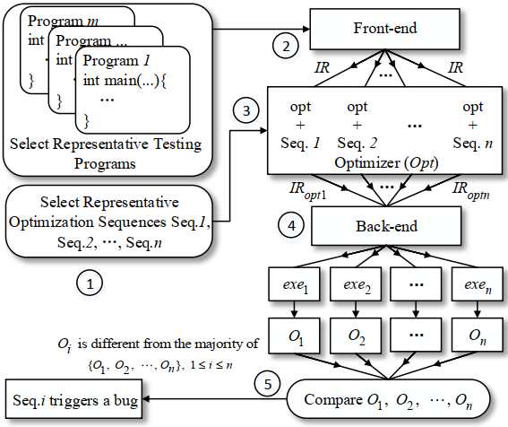
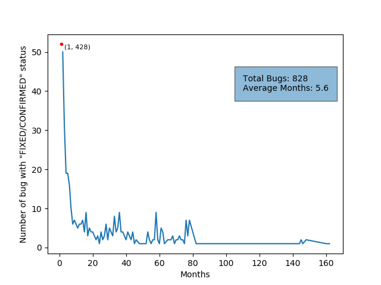
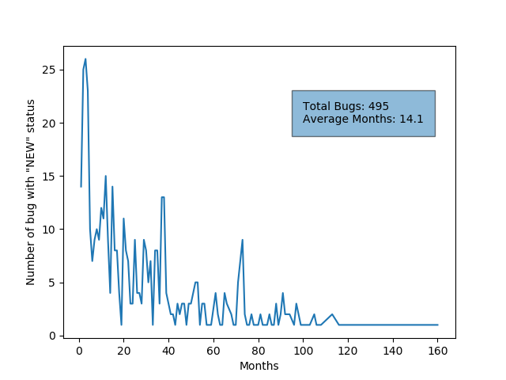

# CTOS: Compiler Testing for Optimization Sequences of LLVM

CTOS is a novel compiler testing method based on differential testing for detecting LLVM bugs caused by optimization sequences. LLVM is a mature and widely used compiler infrastructure. Hundreds of analysis and transformation optimizations have been implemented in LLVM. For more information about LLVM, please referring the website of LLVM, http://llvm.org/.

 The following figure shows the framework of CTOS.

CTOS is composed of 5 steps. (1) The first step is to select representative optimization sequences and testing programs for finding as many unique bugs as possible in reasonable time. (2) Then, the front-end of a compiler is used to emit the IR file of a given testing program without optimizations. (3) The third step is to optimize the IR produced in the previous step using the optimizer $Opt$ of LLVM with the selected optimization sequences. For the IR of a testing program, if there are $n$ selected optimization sequences, $n$ optimized IRs (i.e., $IR_{opt1}$, $IR_{opt2}$, $\cdots$, $IR_{optn}$) will be produced by the optimizer $Opt$. (4) In the fourth step, the $n$ optimized IRs are loaded by the back-end of a compiler to generate $n$ executables (i.e., $exe_1$, $exe_2$, $\cdots$, $exe_n$). (5) The final step is to obtain the outputs (i.e., $O_1$, $O_2$, $\cdots$, $O_n$) of $n$ executables and compare them to determine whether there are bugs. The outputs may be different, but the majority of them should be identical. Thus, if there is an output $O_i$ that is different from the majority of \{$O_1$, $O_2$, $\cdots$, $O_n$\}, $1\leq i \leq n$, then the $i$th optimization sequence is deemed to trigger a compiler bug for the given testing program.

Within seven month evaluations on LLVM, we have reported 104 valid bugs within 5 types, of which 21 have been confirmed or fixed. Most of those bugs are crash bugs (57) and wrong code bugs (24). 47 unique optimizations are identified
to be faulty and 15 of them are loop related optimizations.  

## Tested Optimization

In our study, C programs are used as the inputs for LLVM in our experiments, thus we mainly focus on testing the machine independent optimizations of LLVM that are useful for C programming language. We currently do not consider the optimizations for object-oriented programming languages (e.g., C++ and Objective-C), profile guided optimizations and results visualization of optimizations. Finally, 114 optimizations are selected. The detail information of each optimization can be found on LLVM website (http://llvm.org/docs/Passes.html).

| **OPTIMIZATION**                                                 | **OPTIMIZATION**                                                 |
| :----------------------------------------------------------- | :----------------------------------------------------------- |
| -adce -aggressive-instcombine -alignment-from-assumptions -always-inline -argpromotion -barrier -bdce -break-crit-edges -called-value-propagation -callsite-splitting -canonicalize-aliases -consthoist -constmerge -constprop -correlated-propagation -dce -deadargelim -demanded-bits -die -div-rem-pairs -dse -early-cse -early-cse-memssa -ee-instrument -elim-avail-extern -extract-blocks -flattencfg -float2int -forceattrs -functionattrs -globaldce -globalopt -globalsplit -gvn -gvn-hoist -gvn-sink -hotcoldsplit -indvars -inferattrs -inline -instcombine -instsimplify -ipconstprop -ipsccp -irce -jump-threading -lazy-value-info -lcssa -lcssa-verification -libcalls-shrinkwrap | -licm -load-store-vectorizer -loop-accesses -loop-data-prefetch -loop-deletion -loop-distribute -loop-extract -loop-extract-single -loop-idiom -loop-instsimplify -loop-interchange -loop-load-elim -loop-predication -loop-reduce -loop-reroll -loop-rotate -loop-simplify -loop-simplifycfg -loop-sink -loop-unroll -loop-unroll-and-jam -loop-unswitch -loop-vectorize -loop-versioning -loop-versioning-licm -lower-expect -lowerinvoke -lowerswitch -mem2reg -memcpyopt -memdep -memoryssa -mergefunc -mergeicmps -mergereturn -mldst-motion -nary-reassociate -newgvn -partial-inliner -partially-inline-libcalls -pgo-memop-opt -post-inline-ee-instrument -prune-eh -reassociate -reg2mem -rewrite-symbols -rpo-functionattrs -scalar-evolution -scalarizer -sccp |
| **OPTIMIZATION**                                             | **OPTIMIZATION**                                             |
| -separate-const-offset-from-gep -simple-loop-unswitch -simplifycfg -sink -slp-vectorizer -slsr -speculative-execution | -sroa -strip -strip-dead-prototypes -structurizecfg -tailcallelim -transform-warning -verify |

## Reported Bugs

**reported_bugs.xlsx** is the full list of the reported bugs, including bug ID, optimization sequences for each bug, bug type, bug status. In 7 months, we have reported 5 types and 104 valid bugs, of which 21 have been confirmed and fixed. 47 unique
optimization are identified to be faulty and 15 of them are loop related optimizations. The detail information of each bug can be found on the bug repository of LLVM using the following URLs.

**The full list of the reported bugs can be found** [here](https://bugs.llvm.org/buglist.cgi?email1=cszide%40163.com&emailreporter1=1&emailtype1=substring&list_id=171395&query_format=advanced&resolution=---&resolution=FIXED&resolution=INVALID&resolution=WONTFIX&resolution=LATER&resolution=REMIND&resolution=DUPLICATE&resolution=WORKSFORME&resolution=MOVED).

### Crash: 57
- https://bugs.llvm.org/show_bug.cgi?id=40423 (fixed)      
- https://bugs.llvm.org/show_bug.cgi?id=40422      
- https://bugs.llvm.org/show_bug.cgi?id=40431 (fixed)     
- https://bugs.llvm.org/show_bug.cgi?id=40432 (fixed)    
- https://bugs.llvm.org/show_bug.cgi?id=39626 (fixed)    
- https://bugs.llvm.org/show_bug.cgi?id=40421 (fixed)    
- https://bugs.llvm.org/show_bug.cgi?id=40454 (fixed)    
- https://bugs.llvm.org/show_bug.cgi?id=40841 (fixed)     
- https://bugs.llvm.org/show_bug.cgi?id=39645 (fixed)     
- https://bugs.llvm.org/show_bug.cgi?id=40898 (duplicate)     
- https://bugs.llvm.org/show_bug.cgi?id=40899      
- https://bugs.llvm.org/show_bug.cgi?id=40915      
- https://bugs.llvm.org/show_bug.cgi?id=40938      
- https://bugs.llvm.org/show_bug.cgi?id=40926 (duplicate)     
- https://bugs.llvm.org/show_bug.cgi?id=40928 (duplicate)     
- https://bugs.llvm.org/show_bug.cgi?id=40929 (duplicate)     
- https://bugs.llvm.org/show_bug.cgi?id=40933 (duplicate)     
- https://bugs.llvm.org/show_bug.cgi?id=40931 (duplicate)     
- https://bugs.llvm.org/show_bug.cgi?id=40934 (duplicate)     
- https://bugs.llvm.org/show_bug.cgi?id=40930 (fixed)     
- https://bugs.llvm.org/show_bug.cgi?id=40932 (duplicate)     
- https://bugs.llvm.org/show_bug.cgi?id=40927 (duplicate)     
- https://bugs.llvm.org/show_bug.cgi?id=40925 (confirmed)     
- https://bugs.llvm.org/show_bug.cgi?id=41105      
- https://bugs.llvm.org/show_bug.cgi?id=40109      
- https://bugs.llvm.org/show_bug.cgi?id=41096 (worksforme)     
- https://bugs.llvm.org/show_bug.cgi?id=41104 (confirmed)     
- https://bugs.llvm.org/show_bug.cgi?id=41107 (worksforme)     
- https://bugs.llvm.org/show_bug.cgi?id=41108 (worksforme)    
- https://bugs.llvm.org/show_bug.cgi?id=41287      
- https://bugs.llvm.org/show_bug.cgi?id=41288      
- https://bugs.llvm.org/show_bug.cgi?id=41321 (fixed)     
- https://bugs.llvm.org/show_bug.cgi?id=41632      
- https://bugs.llvm.org/show_bug.cgi?id=41694 (worksforme)     
- https://bugs.llvm.org/show_bug.cgi?id=41695 (fixed)     
- https://bugs.llvm.org/show_bug.cgi?id=41696 (confirmed)     
- https://bugs.llvm.org/show_bug.cgi?id=42016      
- https://bugs.llvm.org/show_bug.cgi?id=42194      
- https://bugs.llvm.org/show_bug.cgi?id=42246 (fixed)     
- https://bugs.llvm.org/show_bug.cgi?id=42264 (fixed)    
- https://bugs.llvm.org/show_bug.cgi?id=42268      
- https://bugs.llvm.org/show_bug.cgi?id=42274      
- https://bugs.llvm.org/show_bug.cgi?id=42421      
- https://bugs.llvm.org/show_bug.cgi?id=42422      
- https://bugs.llvm.org/show_bug.cgi?id=42400 (duplicate)     
- https://bugs.llvm.org/show_bug.cgi?id=42612 (duplicate)     
- https://bugs.llvm.org/show_bug.cgi?id=42613      
- https://bugs.llvm.org/show_bug.cgi?id=42611 (fixed)     
- https://bugs.llvm.org/show_bug.cgi?id=41294 (fixed)     
- https://bugs.llvm.org/show_bug.cgi?id=42640 (duplicate)    
- https://bugs.llvm.org/show_bug.cgi?id=42431 (confirmed)     
- https://bugs.llvm.org/show_bug.cgi?id=41484      
- https://bugs.llvm.org/show_bug.cgi?id=42751      
- https://bugs.llvm.org/show_bug.cgi?id=42737 (fixed)     
- https://bugs.llvm.org/show_bug.cgi?id=42787      
- https://bugs.llvm.org/show_bug.cgi?id=42788 (duplicate)     
- https://bugs.llvm.org/show_bug.cgi?id=42808 (duplicate)     

### Invalid IR: 13
- https://bugs.llvm.org/show_bug.cgi?id=41723 (fixed)
- https://bugs.llvm.org/show_bug.cgi?id=41542
- https://bugs.llvm.org/show_bug.cgi?id=41697
- https://bugs.llvm.org/show_bug.cgi?id=42018
- https://bugs.llvm.org/show_bug.cgi?id=41725 (duplicate)
- https://bugs.llvm.org/show_bug.cgi?id=42444
- https://bugs.llvm.org/show_bug.cgi?id=42448
- https://bugs.llvm.org/show_bug.cgi?id=42449
- https://bugs.llvm.org/show_bug.cgi?id=42450
- https://bugs.llvm.org/show_bug.cgi?id=42451 (fixed)
- https://bugs.llvm.org/show_bug.cgi?id=41285
- https://bugs.llvm.org/show_bug.cgi?id=42660
- https://bugs.llvm.org/show_bug.cgi?id=42860

### Wrong Code: 24
- https://bugs.llvm.org/show_bug.cgi?id=41509
- https://bugs.llvm.org/show_bug.cgi?id=41511
- https://bugs.llvm.org/show_bug.cgi?id=41557
- https://bugs.llvm.org/show_bug.cgi?id=41633
- https://bugs.llvm.org/show_bug.cgi?id=41637
- https://bugs.llvm.org/show_bug.cgi?id=41558
- https://bugs.llvm.org/show_bug.cgi?id=41698
- https://bugs.llvm.org/show_bug.cgi?id=41699
- https://bugs.llvm.org/show_bug.cgi?id=41702
- https://bugs.llvm.org/show_bug.cgi?id=41703
- https://bugs.llvm.org/show_bug.cgi?id=41708
- https://bugs.llvm.org/show_bug.cgi?id=41721
- https://bugs.llvm.org/show_bug.cgi?id=41700 (confirmed)
- https://bugs.llvm.org/show_bug.cgi?id=42050
- https://bugs.llvm.org/show_bug.cgi?id=42051
- https://bugs.llvm.org/show_bug.cgi?id=42081
- https://bugs.llvm.org/show_bug.cgi?id=42043 (duplicate)
- https://bugs.llvm.org/show_bug.cgi?id=42275 (confirmed)
- https://bugs.llvm.org/show_bug.cgi?id=42283
- https://bugs.llvm.org/show_bug.cgi?id=41720
- https://bugs.llvm.org/show_bug.cgi?id=42267
- https://bugs.llvm.org/show_bug.cgi?id=42750
- https://bugs.llvm.org/show_bug.cgi?id=42800
- https://bugs.llvm.org/show_bug.cgi?id=42804

### Performance: 9
- https://bugs.llvm.org/show_bug.cgi?id=40895
- https://bugs.llvm.org/show_bug.cgi?id=40900
- https://bugs.llvm.org/show_bug.cgi?id=40937
- https://bugs.llvm.org/show_bug.cgi?id=40949
- https://bugs.llvm.org/show_bug.cgi?id=40950
- https://bugs.llvm.org/show_bug.cgi?id=41289
- https://bugs.llvm.org/show_bug.cgi?id=41291
- https://bugs.llvm.org/show_bug.cgi?id=41320 (confirmed)
- https://bugs.llvm.org/show_bug.cgi?id=41290

### Bug of Code Generator: 1
- https://bugs.llvm.org/show_bug.cgi?id=42452 (fixed)

## Time for confirming or fixing bugs of optimizations
We collect 1323 unique bugs related to scalar optimizations from the bug repository of LLVM from October 2003 to Jun, 2019 to demonstrate that  it is time-consumming for confirming or fixing the bugs of optimizations. '**collected_bugs.txt**' contains the original bug information. In these bugs, 828 bugs have been confirmed or fixed, and 495 bugs still keep the "NEW" status. For the 828 confirmed or fixed bugs, although 428 bugs are confirmed or fixed in one month, developers take more than 15 months to confirm or fix the most residual bugs. The average number of months for confirming or fixing these bugs is 5.6. In addition, 495 bugs with "NEW" status have already existed for a long time, an average of 14.1 months.

Fig. 1 Number of months for confirming or fixing a bug.

Fig. 2 Number of months for the bug with "NEW" status.
